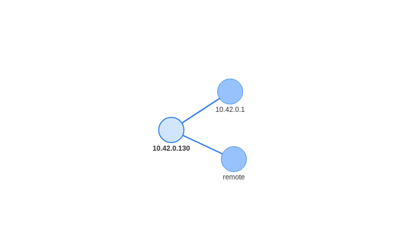
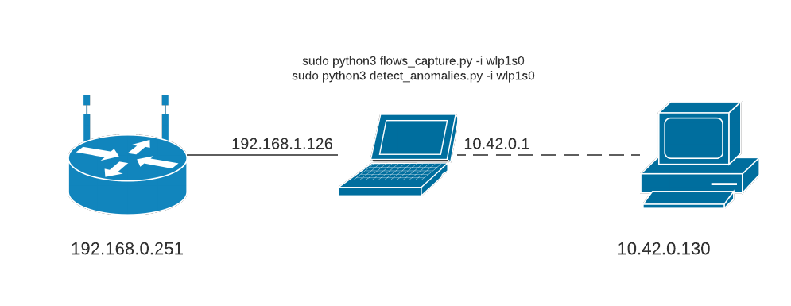

# Map of the services

## Introduction
The goal of the project was to build a script able to identify network anomalies looking at a *map of the services.*

First, the software records the network's behavior, the `flows_capture.py` file captures network traffic and generates, using the *nfstream* library, the packet-related flows.

Based on these flows, a services' map will be created, to be used as a filter to identify potential anomalies (unknown protocol, unknown source ip, ...).

## Requirements
To run the script, the `nfstream` library have to be installed:

`sudo pip3 install nfstream`

**IMPORTANT:** execute the command with superuser permissions

## Map of the services 
The purpose of the program is to detect anomalies on the network, related to one or more devices. To do so, a **services' map** is used, namely a data structure that describes *which hosts communicated with other hosts and which protocols were used*, for example looking at `services_map.json`:
- *10.42.0.130* sent only DNS requests to *10.42.0.1*,
- *remote* communicated with *10.42.0.130* only via TLS.

The services map is a **json file** (`services_map.json`), a key-value dictionary:
- **key:** source ip
- **value:** list of key-value pairs
  - **sub_key:** destination ip
  - **sub_value:** array containing the number of bytes that the two hosts have exchanged and a list of the protocols used.

```json
"10.42.0.130": {
        "10.42.0.1": [
            87215,
            "DNS",
            "DNS.Microsoft",
            "DNS.NetFlix",
            "..."
        ],
        "remote": [
            169616558,
            "TLS",
            "HTTP",
            "..."
        ]
    },
```

Based on our knowledge of the analyzed devices (e.g. a smart TV will mostly do streaming and web browsing) we can create a services' map representing the "behaviour" of the devices, monitoring the network traffic in and out from them.

For this project I had the opportunity to analyze only one device, primarily intended for online streaming activities (YouTube, Netflix....). This is a possible representation of the services' map (arcs are marked by a list of protocols):



## Anomaly
First of all, an **anomaly** is defined as a *network traffic that deviates from the one described in the services' map,* for example, traffic may be generated with a protocol never used by that device (to that particular host) or data may be sent/received to/from an unknown host.

In order to detect anomalies, the flow information, generated in real time by packets, are compared with map's informations:
| Condition | Value returned |
| --------- | -------------- |
| **src_host** is not present within the map (as source ip) | "UNKNOWN_SOURCE_IP" |
| **dst_host** is not present within the map (as dst. ip)   | "UNKNOWN_DESTINATION_IP" |
| **protocol** other than those used by the (src, dst) pair is detected | "PROTOCOL_NEVER_USED" | 
| main **protocol** is DNS or TLS | "DNS/TLS APPLICATION" |
| **protocol** is unknown ("Unknown") |  "UNKNOWN PROTOCOL" |

The last two cases are minor anomalies because they identify atypical network behaviour but in most cases they do not pose a threat like the other anomalies; for instance, if my machine starts generating TLS traffic from Ebay, while the only TLS traffic observed on that device is related to Amazon, it is important to notify the user but it's very unlikely that it will generate a threat.

I choose to avoid notifying multiple anomalies related to a single flow but to prioritize one of them; for instance, if my device contacts an unknown local host with an unknown protocol, the only anomaly notified will be "UNKNOWN_DESTINATION_IP", skipping the "UNKNOWN PROTOCOL" one.

## Tests and results

### Network setup
*Note:* During the tests, the scripts have been executed on a machine which is not the one analyzed. Moreover, the tests have been carried out on a local subnet (10.0.0.0/8) where the machine has the role of router:



Other configurations are possible, for instance, monitoring the packets and forwarding the traffic on a specific port of the router, on which a device will be connected. The remote device will run the script. This scenario is more realistic due to the fact that a router is not able to do a lot of operations due to its computational limits, so an external computational unit is mandatory.

### Tests
I run the scripts for sixty minutes, trying to perform one by one all the available functionalities of the device. Then, I created the services' map using `detect_anamolies.py` and I used the device for a few minutes, while the program was analyzing all the flows in real time.

To test the anomalies detection, I have generated torrent traffic and open few SSH sessions to remote hosts (PROTOCOL_NEVER_USED). Furthermore, as expected, the communication, between the device and an unknown local machine, has been detected as an anomaly of type *source/destination ip unknown.* The final results have been stored inside the report.

*Note:* inside the report you can find the list of the used protocols and the bidirectional bytes of the flows.
*Note:* anomalies detection can be performed on a *.pcap file*, using the flag `-i` with argument the absolute or relative path of the *.pcap* file.

## Usage and behavior
*Note: The file `config.json` contains the parameters used by the script, like the name of the output file.*

Execute `sudo flows_capture.py -i eth0` to capture the traffic from the `eth0` interface and to obtain in output a file containing the flows. The superuser's permissions are needed to activate the capture from the network interface.

Now, execute `sudo detect_anomalies.py -i eth0` to generate the services' map and to start capturing the packets through the `eth0` network interface; the script in real time analyses the flows' informations checking for anomalies. For every flow examined, a result will be displayed:

```
 1.  10.42.0.130     --> 10.42.0.1       , DNS                  | NONE
 2.  10.42.0.130     --> 10.42.0.1       , DNS                  | NONE
 3.  10.42.0.130     --> 10.42.0.1       , DNS.AmazonVideo      | NONE
 4.  10.42.0.130     --> remote          , TLS.Amazon           | NONE
 5.  10.42.0.130     --> 10.42.0.1       , DNS.AmazonVideo      | NONE
...
 65. 10.42.0.130     --> remote          , BitTorrent           | PROTOCOL NEVER USED
 66. 10.42.0.130     --> remote          , BitTorrent           | PROTOCOL NEVER USED
 67. 10.42.0.130     --> remote          , BitTorrent.Amazon    | PROTOCOL NEVER USED
 68. 10.42.0.130     --> remote          , BitTorrent           | PROTOCOL NEVER USED
 69. 10.42.0.130     --> remote          , BitTorrent           | PROTOCOL NEVER USED
 70. 10.42.0.130     --> remote          , BitTorrent           | PROTOCOL NEVER USED
 71. 10.42.0.130     --> remote          , BitTorrent           | PROTOCOL NEVER USED
 72. 10.42.0.130     --> remote          , BitTorrent           | PROTOCOL NEVER USED
 73. 10.42.0.130     --> remote          , BitTorrent           | PROTOCOL NEVER USED
 74. 10.42.0.130     --> remote          , BitTorrent           | PROTOCOL NEVER USED
 75. 10.42.0.130     --> remote          , BitTorrent           | PROTOCOL NEVER USED
 76. 10.42.0.130     --> remote          , BitTorrent           | PROTOCOL NEVER USED
...
319. 10.42.0.130     --> remote          , TLS                  | NONE
320. 10.42.0.130     --> remote          , TLS.Wikipedia        | DNS/TLS APPLICATION
321. 10.42.0.130     --> remote          , TLS.Wikipedia        | DNS/TLS APPLICATION
322. remote          --> 10.42.0.130     , ICMP                 | PROTOCOL NEVER USED
323. 10.42.0.130     --> remote          , QUIC.Google          | NONE
324. 10.42.0.130     --> remote          , BitTorrent           | PROTOCOL NEVER USED
325. 10.42.0.130     --> remote          , QUIC.Google          | NONE
326. 10.42.0.130     --> remote          , TLS.YouTube          | NONE
327. 10.42.0.130     --> remote          , BitTorrent           | PROTOCOL NEVER USED
...
364. 10.42.0.130     --> 10.42.0.1       , DNS.UbuntuONE        | DNS/TLS APPLICATION
365. 10.42.0.130     --> 10.42.0.96      , Unknown              | UNKNOWN DESTINATION IP
366. 10.42.0.130     --> remote          , SSH                  | PROTOCOL NEVER USED
367. remote          --> 10.42.0.130     , Unknown              | UNKNOWN PROTOCOL
368. 10.42.0.130     --> 10.42.0.96      , Unknown              | UNKNOWN DESTINATION IP
369. 10.42.0.130     --> 10.42.0.1       , DNS                  | NONE
370. 10.42.0.130     --> 10.42.0.1       , DNS                  | NONE
371. 10.42.0.130     --> 10.42.0.96      , Unknown              | UNKNOWN DESTINATION IP
372. 10.42.0.130     --> 10.42.0.96      , TLS                  | UNKNOWN DESTINATION IP
373. 10.42.0.130     --> 10.42.0.96      , Unknown              | UNKNOWN DESTINATION IP
374. 10.42.0.130     --> 10.42.0.1       , DHCP                 | PROTOCOL NEVER USED
375. 10.42.0.130     --> remote          , NTP.UbuntuONE        | NONE
376. remote          --> 10.42.0.130     , Unknown              | UNKNOWN PROTOCOL
```

Periodically, an anomalies' report is saved in the local machine. After the capture, the user can executes `sudo python3 detect_anomalies.py` with flag `-a` to obtain a formatted version of the report:

```
+++++++ NONE anomaly flows +++++++
+ 10.42.0.130     exchange  71595235 bytes with: 
         - 10.42.0.1      ,     51994 bytes (0.07%) using ['DNS', 'DNS.AmazonVideo', 'DNS.Amazon', 'DNS.Google', 'DNS.GoogleServices', 'DNS.Microsoft', 'DNS.NetFlix', 'DNS.YouTube']
         - remote         ,  71543241 bytes (99.93%) using ['TLS', 'TLS.Amazon', 'HTTP', 'TLS.AmazonVideo', 'TLS.Google', 'QUIC.Google', 'TLS.YouTube', 'HTTP.Google', 'NTP.UbuntuONE', 'TLS.Cloudflare', 'QUIC.YouTube', 'TLS.GoogleServices']

+++++++ DNS/TLS APPLICATION anomaly flows +++++++
+ 10.42.0.130     exchange   1680371 bytes with: 
         - 10.42.0.1      ,      2417 bytes (0.14%) using ['DNS.Wikipedia', 'DNS.UbuntuONE']
         - remote         ,   1677954 bytes (99.86%) using ['TLS.Wikipedia']

+++++++ PROTOCOL NEVER USED anomaly flows +++++++
+ 10.42.0.130     exchange     67578 bytes with: 
         - remote         ,     66886 bytes (98.98%) using ['BitTorrent', 'BitTorrent.Amazon', 'ICMP', 'IGMP', 'SSDP', 'SSH']
         - 10.42.0.1      ,       692 bytes (1.02%) using ['DHCP']
+ remote          exchange      1399 bytes with: 
         - 10.42.0.130    ,      1399 bytes (100.00%) using ['ICMP', 'ICMP.Amazon']

+++++++ UNKNOWN DESTINATION IP anomaly flows +++++++
+ 10.42.0.130     exchange   5154607 bytes with: 
         - 10.42.0.96     ,   5154607 bytes (100.00%) using ['Unknown', 'TLS']

+++++++ UNKNOWN SOURCE IP anomaly flows +++++++
+ 10.42.0.1       exchange      2600 bytes with: 
         - 10.42.0.130    ,      2600 bytes (100.00%) using ['ICMP']

+++++++ UNKNOWN PROTOCOL anomaly flows +++++++
+ 10.42.0.130     exchange      2040 bytes with: 
         - 10.42.0.1      ,      2040 bytes (100.00%) using ['Unknown']
+ remote          exchange      2198 bytes with: 
         - 10.42.0.130    ,      2198 bytes (100.00%) using ['Unknown']

+++++++ On 561 flows, 159 anomalies +++++++
```
